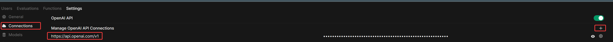
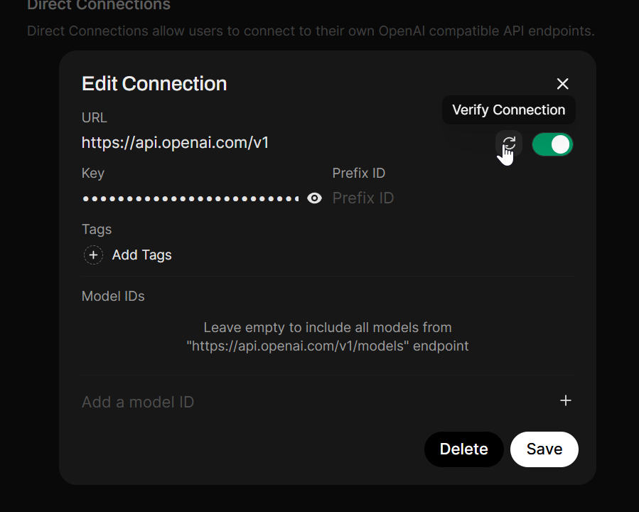
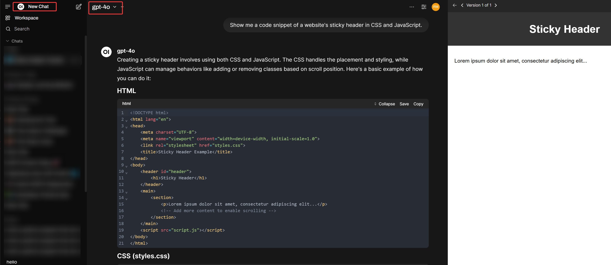
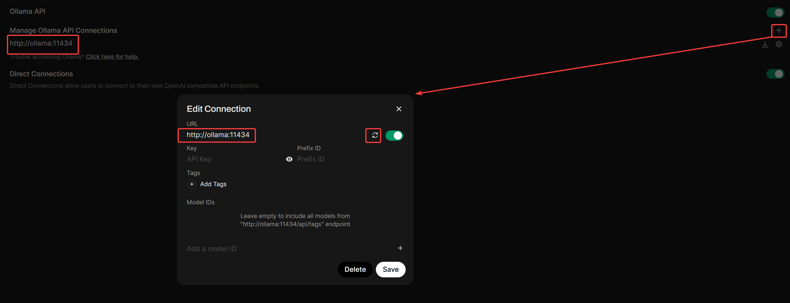
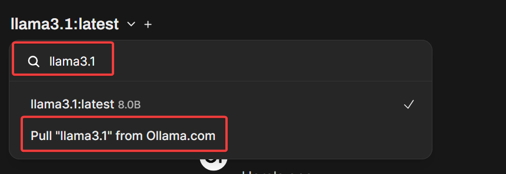

OpenWebUI offers a comprehensive interface for chat models, tools, RAG, and MCPs. While Ollama provides an easy way to run models locally, you'll need an Nvidia GPU (8GB+ RAM) for optimal performance. Without a suitable GPU, you can skip the Ollama installation entirely.
Most users will achieve better productivity using API services like OpenAI, Google, or Anthropic rather than running models locally. If you have an Nvidia GPU and want to set up Ollama, continue to the next step; otherwise, skip the Ollama-specific steps.

## Pre-Reqs For Ollama Nvidia GPU Setup

We already set up WSL2 linux and docker with portainer in the previous lesson. If you haven’t done that yet, please get linux & portainer up and running. Next - 

- Install nvidia cuda toolkit 12.5 for WSL2 - 
```bash
wget https://developer.download.nvidia.com/compute/cuda/repos/wsl-ubuntu/x86_64/cuda-keyring_1.1-1_all.deb
sudo dpkg -i cuda-keyring_1.1-1_all.deb
sudo apt-get update
sudo apt-get -y install cuda-toolkit-12-5
```
- **note** \- that’s for WSL2 users. For ubuntu (enter the version of ubuntu corresponding to your distro - this is ubuntu 24.04) -

```bash
wget https://developer.download.nvidia.com/compute/cuda/repos/ubuntu2404/x86_64/cuda-keyring_1.1-1_all.deb
sudo dpkg -i cuda-keyring_1.1-1_all.deb
sudo apt-get update
sudo apt-get -y install cuda-toolkit-12-5
```

CUDA toolkit 12.5 is widely supported by most Nvidia GPUs and compatible with most AI tools. It is recommended NOT to go for the bleeding edge with Nvidia drivers/toolkits UNLESS you’re running a 5xxx series nvidia GPU, as a lot of AI tools lag support of latest NVidia drivers & CUDA versions by a solid 3-6 months+.  


- Install nvidia container toolkit -

Container toolkit is required for CUDA support in docker (essentially docker GPU passthrough)

1. Configure the production repository:
```bash
curl -fsSL https://nvidia.github.io/libnvidia-container/gpgkey | sudo gpg --dearmor -o /usr/share/keyrings/nvidia-container-toolkit-keyring.gpg \
  && curl -s -L https://nvidia.github.io/libnvidia-container/stable/deb/nvidia-container-toolkit.list | \
    sed 's#deb https://#deb [signed-by=/usr/share/keyrings/nvidia-container-toolkit-keyring.gpg] https://#g' | \
    sudo tee /etc/apt/sources.list.d/nvidia-container-toolkit.list
```
2. Update the packages list from the repository:
```bash
sudo apt-get update
```
3. Install the NVIDIA Container Toolkit packages:
```bash
sudo apt-get install -y nvidia-container-toolkit nvidia-container-runtime
```
4. Configure Docker to use Nvidia driver

```bash
sudo nvidia-ctk runtime configure --runtime=docker
sudo systemctl restart docker
```

Now you're ready to install ollama and spin up local AI models.

## Create a Stack for Ollama & OpenWebUI

Inside portainer, we’re going to create a stack for ollama and open-webui. From the side menu inside your container group, press `stacks` button. From there, press `add stack` to create a new stack. Give the Stack an appropriate name, use the web editor as the build method, and populate as below -


Here’s the stack config if you are building ollama with an Nvidia GPU with openwebUI.

```yaml
services:
  ollama:
    volumes:
      - ollama:/root/.ollama
    deploy:
      resources:
        reservations:
          devices:
            - driver: nvidia
              count: all
              capabilities: [gpu]
    container_name: ollama
    pull_policy: always
    tty: true
    restart: unless-stopped
    ports:
      - 11434:11434
    image: ollama/ollama:${OLLAMA_DOCKER_TAG-latest}
    networks:
      - docker_default
      
  open-webui:
    build:
      context: .
      args:
        OLLAMA_BASE_URL: '/ollama'
      dockerfile: Dockerfile
    image: ghcr.io/open-webui/open-webui:dev-cuda
    container_name: open-webui
    volumes:
      - open-webui:/app/backend/data
    depends_on:
      - ollama
    deploy:
      resources:
        reservations:
          devices:
            - driver: nvidia
              count: all
              capabilities: [gpu]
    ports:
      - ${OPEN_WEBUI_PORT-3000}:8080
    environment:
      - 'OLLAMA_BASE_URL=http://ollama:11434'
      - 'WEBUI_SECRET_KEY='
      - host.docker.internal:host-gateway
    restart: unless-stopped
    networks:
      - docker_default
      
volumes:
  ollama: {}
  open-webui: {}

networks:
  docker_default:
    external: true
```

press “deploy the stack”

Now you have full control over the stack via portainer and can update and modify your containers by accessing the stack editor.


If you don’t have an nvidia GPU and/or don't want to install ollama (I promise it’s just a nice to have not a need to have), you have a much simpler docker compose file that just installs OpenWebUI -

```yaml
services:
  open-webui:
    build:
      context: .
      args:
        OLLAMA_BASE_URL: '/ollama'
      dockerfile: Dockerfile
    image: ghcr.io/open-webui/open-webui:dev-cuda
    container_name: open-webui
    volumes:
      - open-webui:/app/backend/data
    ports:
      - ${OPEN_WEBUI_PORT-3000}:8080
    environment:
      - 'OLLAMA_BASE_URL=http://ollama:11434'
      - 'WEBUI_SECRET_KEY='
      - host.docker.internal:host-gateway
    restart: unless-stopped
    networks:
      - docker_default

volumes:
  open-webui: {}
  
networks:
  docker_default:
    external: true
```

## Configure OpenAI Integration in OpenWebUI

OpenAI integration in OpenwebUI will unlock powerful capabilities that we’ll cover in future lessons (hint - think agents). For now, we’ll just focus on getting the integration working.

First, access the OpenWebUI web interface -

[http://localhost:3000/](http://localhost:3000/)

create a login account.

click name at bottom → settings


then click “admin settings”.

From admin settings, click “connections”. Under **Manage OpenAI API Connections**, press the “+” to add a new connection.



The base url for openai is `https://api.openai.com/v1`. Enter your API key as required. If you don’t have an API key with openai yet, create one. [https://platform.openai.com/api-keys](https://platform.openai.com/api-keys)

This will require you to link a credit card to your account if you haven’t already, as each prompt from openWebUI is an API call.

Once you’ve entered the API url and your API key, test the connection and confirm it’s good.



Make sure you can verify the connection.

Test the API by starting a new chat, selecting an OpenAI model from the dropdown, and asking a question (OpenwebUI gives you “suggested prompts” to test if you’re lazy)



## Configure Ollama (If using local AI)

From the same “connections” menu we added our OpenAI connection, Under “Manage Ollama API Connections”, add a new connection. We’re going connect directly to the ollama docker container by it’s name. This works because both containers are on the same local network.



## Test Ollama

Press the “new chat” button at the top left panel to start a new chat session.

Type in `llama3.1` in the search bar from the “select a model” dropdown. You will have the option to the model if the repo exists.



Select the option to pull the model and it will automatically pull the model and make it available use via the dropdown menu. Run a test prompt to make sure it works.


**note:** llama 3.1 is an older model, we’re simply testing that our ollama connection works. We’ll focus on local models in greater detail in later lessons. Llama 3.1 is a good test model because it’s only 5GB in size, which should fit fine in most consumer Nvidia GPUs.

## Enable web search

From the web search menu, toggling on “Enable Web Search” will use `duckduckgo` by default.


Test web search functionality by toggling it on and testing it with a prompt that would require the llm to search the web to find the appropriate answer.


All set!

Now we can get to the fun stuff.  


