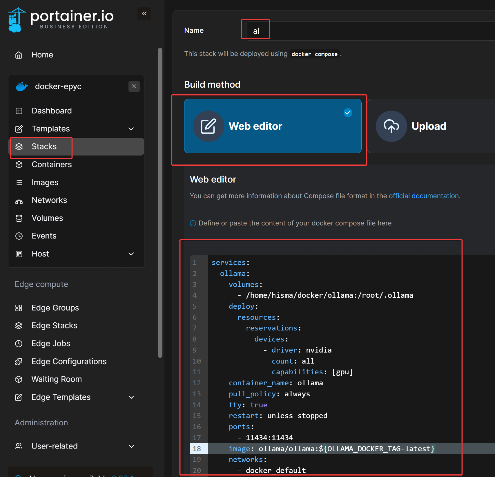
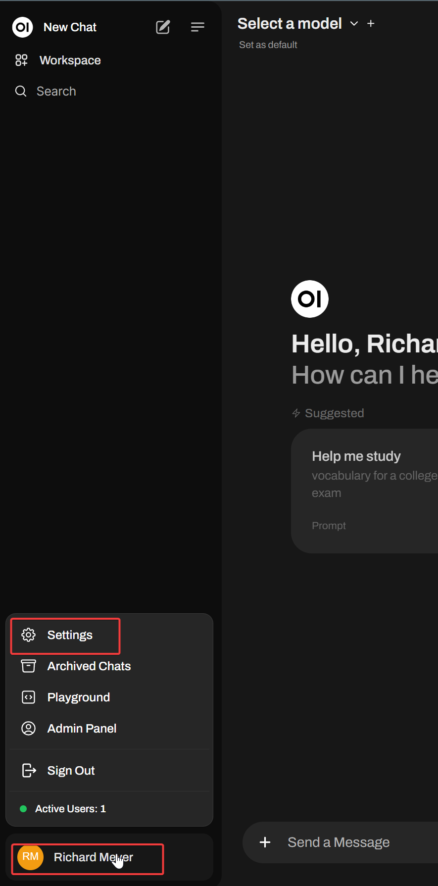
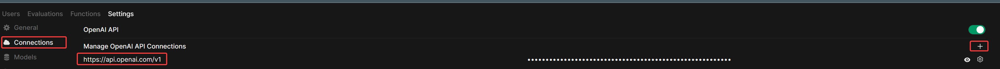
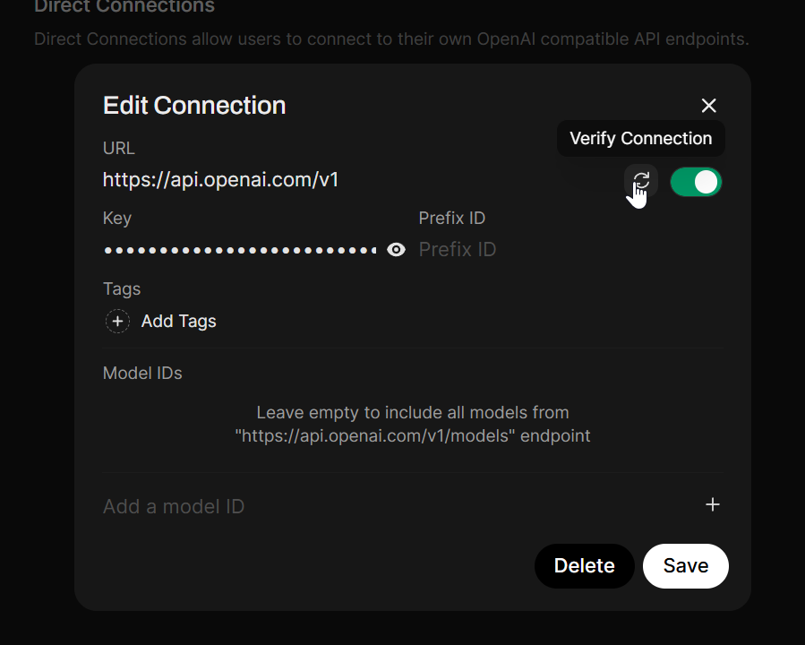
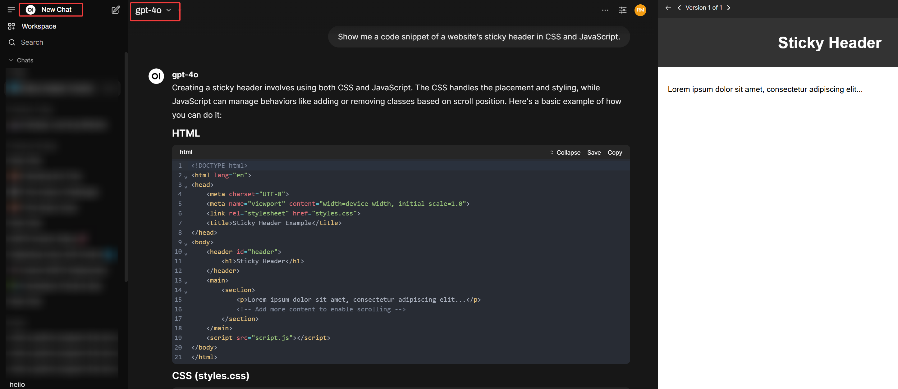
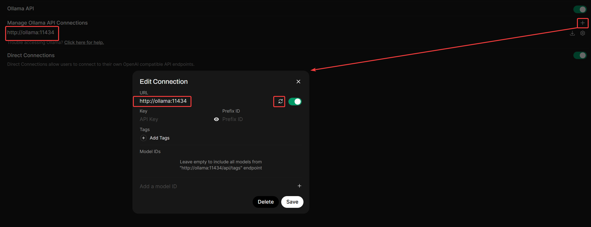
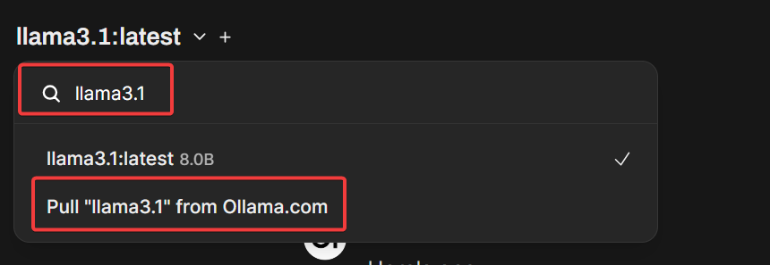
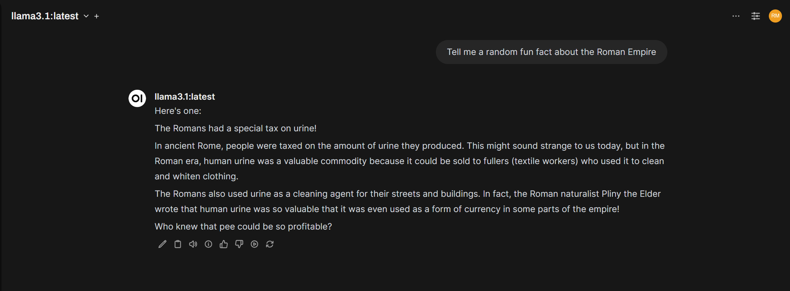

import { YouTube } from "astro-embed";

<YouTube id="GDqLje4SobM" />

## Why Ollama + OpenWebUI?

Ollama paired with OpenWebUI delivers the best of both worlds — powerful AI capabilities with a user-friendly interface.

**Ollama** runs advanced language models locally on your machine, giving you privacy, control, and cost savings compared to cloud-based alternatives. It handles the complex technical aspects of running models like LLaMA, Mistral, and Gemma efficiently on your hardware.

**OpenWebUI** transforms this powerful backend into something anyone can use. Its intuitive chat interface feels familiar if you've used ChatGPT, but with key advantages:

* **Mix and match models**: Easily switch between local models or connect to OpenAI for the best of both worlds
* **Document-enhanced conversations**: Upload files and use Retrieval-Augmented Generation (RAG) to get answers based on your own data
* **Python tools and extensions**: Add capabilities like web search, image generation, or data analysis that your AI can use during conversations
* **Model Context Protocol (MCP) support**: Connect your AI to external tools and data sources like Figma design files, Obsidian notes, Gmail for email management, and even Blender for 3D modeling, all through natural language
* **Complete control**: Customize prompts, manage multiple models, and ensure your data stays private when needed

Whether you're a developer looking to build custom AI solutions or simply want a ChatGPT-like experience without subscription costs, this combination gives you flexibility without requiring deep technical knowledge.

## Is Ollama for you?

While Ollama provides an easy way to run models locally, this lesson assumes you have an Nvidia GPU with 8GB+ of RAM. While it's possible to run Ollama effectively on AMD and certain Mac hardware, they require different set up which is beyond the scope of this article. 
If you don't have an Nvidia GPU in your machine, you can skip Ollama installation and just install OpenWebUI. Don't fret however, you'll still have a powerful local AI platform with OpenWebUI alone by integrating it with OpenAI using an API key, which this lesson also covers. But if you have an Nvidia GPU and want to set up Ollama, continue to the next step; otherwise, you can skip the Ollama-specific steps.

## Pre-Reqs For Ollama Nvidia GPU Setup

We already set up WSL2 linux and docker with portainer in the previous lesson. If you haven’t done that yet, please get linux & portainer up and running. Next -

- Install nvidia cuda toolkit 12.5 for WSL2 -

```bash
wget https://developer.download.nvidia.com/compute/cuda/repos/wsl-ubuntu/x86_64/cuda-keyring_1.1-1_all.deb
sudo dpkg -i cuda-keyring_1.1-1_all.deb
sudo apt-get update
sudo apt-get -y install cuda-toolkit-12-5
```

- **note** - that’s for WSL2 users. For non-WSL2 Ubuntu users (enter the version of ubuntu corresponding to your distro - this is ubuntu 24.04) -

```bash
wget https://developer.download.nvidia.com/compute/cuda/repos/ubuntu2404/x86_64/cuda-keyring_1.1-1_all.deb
sudo dpkg -i cuda-keyring_1.1-1_all.deb
sudo apt-get update
sudo apt-get -y install cuda-toolkit-12-5
```

CUDA toolkit 12.5 is widely supported by most Nvidia GPUs and compatible with most AI tools. It is recommended NOT to go for the bleeding edge with Nvidia drivers/toolkits UNLESS you’re running a 5xxx series nvidia GPU, as a lot of AI tools lag support of latest NVidia drivers & CUDA versions by a solid 3-6 months+.

- Install nvidia container toolkit -

Container toolkit is required for CUDA support in docker (essentially docker GPU passthrough)

1. Configure the production repository:

```bash
curl -fsSL https://nvidia.github.io/libnvidia-container/gpgkey | sudo gpg --dearmor -o /usr/share/keyrings/nvidia-container-toolkit-keyring.gpg \
  && curl -s -L https://nvidia.github.io/libnvidia-container/stable/deb/nvidia-container-toolkit.list | \
    sed 's#deb https://#deb [signed-by=/usr/share/keyrings/nvidia-container-toolkit-keyring.gpg] https://#g' | \
    sudo tee /etc/apt/sources.list.d/nvidia-container-toolkit.list
```

2. Update the packages list from the repository:

```bash
sudo apt-get update
```

3. Install the NVIDIA Container Toolkit packages:

```bash
sudo apt-get install -y nvidia-container-toolkit nvidia-container-runtime
```

4. Configure Docker to use Nvidia driver

```bash
sudo nvidia-ctk runtime configure --runtime=docker
sudo systemctl restart docker
```

Now you're ready to install ollama and spin up local AI models.

## Create a Stack for Ollama & OpenWebUI

Inside portainer, we’re going to create a stack for ollama and open-webui. From the side menu inside your container group, press `stacks` button. From there, press `add stack` to create a new stack. Give the Stack an appropriate name, use the web editor as the build method, and populate as below -



Here’s the stack config if you are building ollama with an Nvidia GPU with openwebUI.

```yaml
services:
  ollama:
    volumes:
      - ollama:/root/.ollama
    deploy:
      resources:
        reservations:
          devices:
            - driver: nvidia
              count: all
              capabilities: [gpu]
    container_name: ollama
    pull_policy: always
    tty: true
    restart: unless-stopped
    ports:
      - 11434:11434
    image: ollama/ollama:${OLLAMA_DOCKER_TAG-latest}
    networks:
      - docker_default

  open-webui:
    image: ghcr.io/open-webui/open-webui:dev-cuda
    container_name: open-webui
    volumes:
      - open-webui:/app/backend/data
    depends_on:
      - ollama
    deploy:
      resources:
        reservations:
          devices:
            - driver: nvidia
              count: all
              capabilities: [gpu]
    ports:
      - ${OPEN_WEBUI_PORT-3000}:8080
    environment:
      - "OLLAMA_BASE_URL=http://ollama:11434"
      - "WEBUI_SECRET_KEY="
      - host.docker.internal:host-gateway
    restart: unless-stopped
    networks:
      - docker_default

volumes:
  ollama: {}
  open-webui: {}

networks:
  docker_default:
    external: true
```

press “deploy the stack”

Now you have full control over the stack via portainer and can update and modify your containers by accessing the stack editor.


If you don’t have an nvidia GPU and/or don't want to install ollama, you have a much simpler docker compose file that just installs OpenWebUI -

```yaml
services:
  open-webui:
    image: ghcr.io/open-webui/open-webui:latest
    container_name: open-webui
    volumes:
      - open-webui:/app/backend/data
    ports:
      - ${OPEN_WEBUI_PORT-3000}:8080
    environment:
      - "WEBUI_SECRET_KEY="
      - host.docker.internal:host-gateway
    restart: unless-stopped
    networks:
      - docker_default

volumes:
  open-webui: {}

networks:
  docker_default:
    external: true
```

## Configure OpenAI Integration in OpenWebUI

OpenAI integration in OpenwebUI will unlock powerful capabilities that we’ll cover in future lessons (hint - think agents). For now, we’ll just focus on getting the integration working.

First, access the OpenWebUI web interface -

[http://localhost:3000/](http://localhost:3000/)

create a login account.

click name at bottom → settings



then click “admin settings”.

From admin settings, click “connections”. Under **Manage OpenAI API Connections**, press the “+” to add a new connection.



The base url for openai is `https://api.openai.com/v1`. Enter your API key as required. If you don’t have an API key with openai yet, create one. [https://platform.openai.com/api-keys](https://platform.openai.com/api-keys)

This will require you to link a credit card to your account if you haven’t already, as each prompt from openWebUI is an API call.

Once you’ve entered the API url and your API key, test the connection and confirm it’s good.



Make sure you can verify the connection.

Test the API by starting a new chat, selecting an OpenAI model from the dropdown, and asking a question (OpenwebUI gives you “suggested prompts” to test if you’re lazy)



## Configure Ollama (If using local AI)

From the same “connections” menu we added our OpenAI connection, Under “Manage Ollama API Connections”, confirm you see the connection we configured as an environment variable when we set up docker container `OLLAMA_BASE_URL=http://ollama:11434`.



We directly connect to the ollama docker container by it’s name. This works because both containers are on the same local network.

## Test Ollama

Press the “new chat” button at the top left panel to start a new chat session.

Type in `llama3.1` in the search bar from the “select a model” dropdown. You will have the option to the model if the repo exists.



Select the option to pull the model and it will automatically pull the model and make it available use via the dropdown menu. Run a test prompt to make sure it works.



**note:** llama 3.1 is an older model, we’re simply testing that our ollama connection works. We’ll focus on local models in greater detail in later lessons. Llama 3.1 is a good test model because it’s only 5GB in size, which should fit fine in most consumer Nvidia GPUs.

All set!

Now we can use OpenWebUI as our interface for creating a RAG pipeline (local knowledge-base), agentic AI workflows, tool usage, and more. We'll explore RAG and creating a local knowledgebase in OpenWebUI next.
